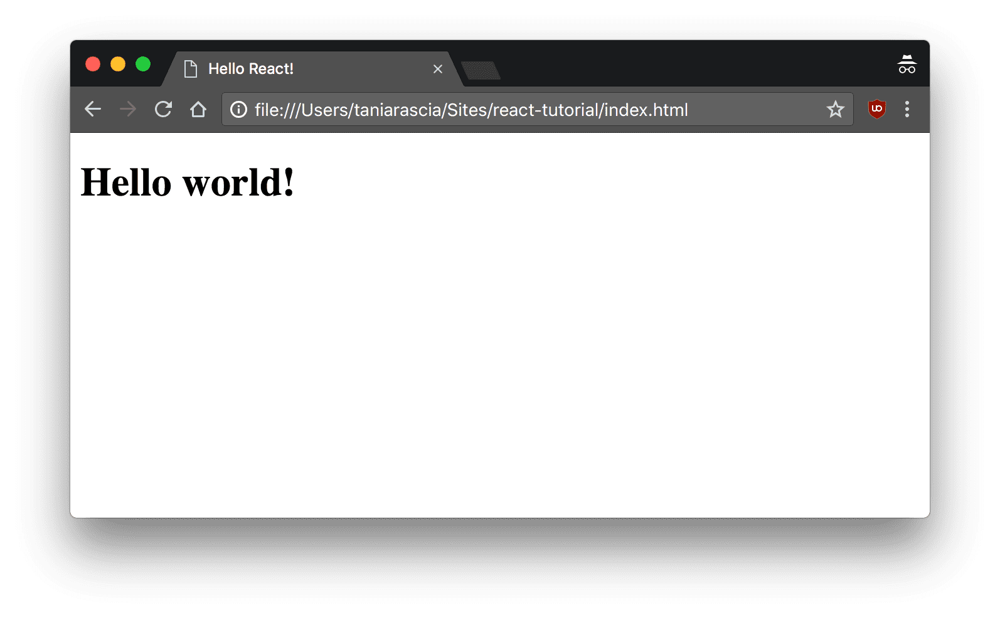
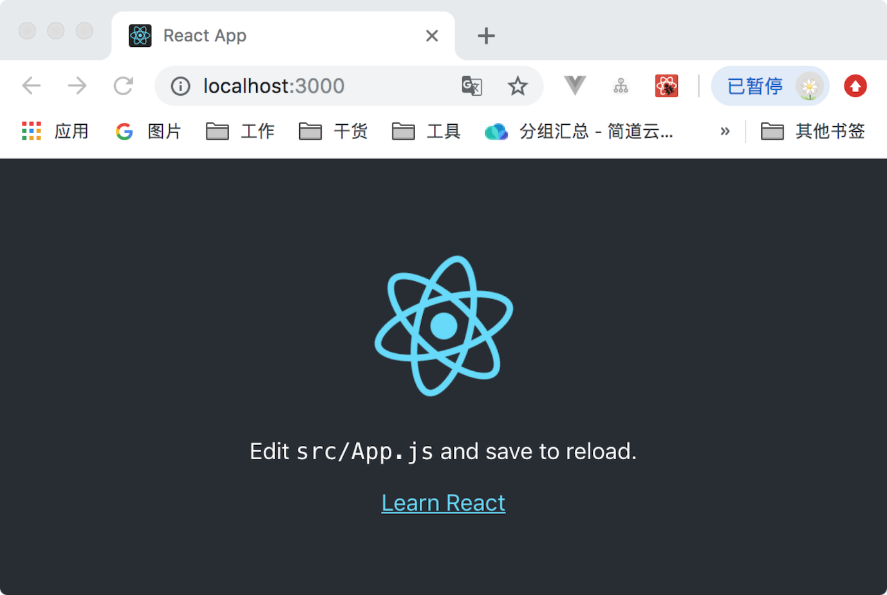
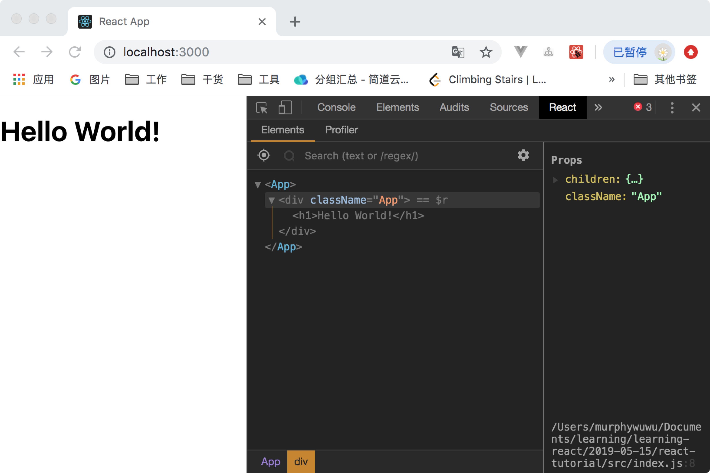
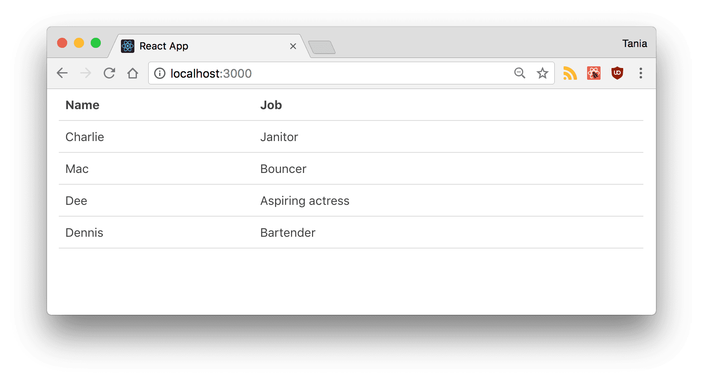
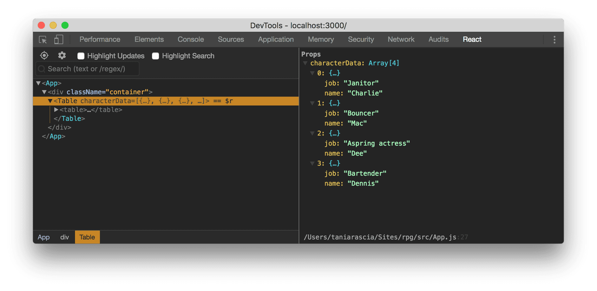

## react入门-概述和演练教程（翻译）

[原文地址](https://www.taniarascia.com/getting-started-with-react/) ： https://www.taniarascia.com/getting-started-with-react/

在我刚开始学习JavaScript时，我就已经听过react，但是我不得不承认我只看了一眼就被吓住了。我看到一堆HTML标签中混合着JavaScript，然后很疑惑，难道我们不是应该尽量避免这么写吗？react有什么大不了的？

所以，我专注于学习vanilla JavaScript，并在更专业的环境中使用jQuery。经过几次沮丧和失败的使用react后，我终于开始学习react，我开始意识到为什么我更需要react而不是vanilla JS和jQuery。

我努力将我学到的所有内容压缩成一个不错的介绍分享给你们，就是接下来的内容。

### **预备知识**

在玩耍react之前，有一些事情你必须有所了解。如果你之前从未使用过js或者DOM，例如，我在使用react之前，已经熟悉了以下知识。

以下是我认为学习react之前所需要掌握的

- HTML和CSS的基础知识
- JavaScript和变成的基础知识
- 对DOM有一定的理解
- 熟悉ES6的语法和功能
- 全局安装了npm和Node.js

### **目标**

- 了解基本的react组成和相关术语，例如Babel，Webpack，JSX，组件，props，state，和生命周期
- 创建一个简单的react应用，演示以上概念

以下是最终结果源码和demo

- [View Sourve on Github](https://github.com/taniarascia/react-tutorial)
- [View Demo](https://taniarascia.github.io/react-tutorial/)

### **react是什么？**

- react是一个js库——最受欢迎的库之一，在github上有100000+star
- react不是一个框架（不像Angular，Angular更死板）
- react是Facebook的一个开源项目
- react在前端被用来创建用户界面（UI）
- react是MVC应用程序的view层（Model View Controller）

react最重要的一个方面之一就是你可以创建定制化和可复用HTML元素的组件，这样就可以快速有效的创建用户界面。react还使用state和props来简化了数据的存储和使用。

我们将在整篇文章中全面了解这些，让我们开始吧。

### **设置和安装**

有几种方法可以安装react，我会告诉你两种，这样你就可以很好的了解它是如何工作的。

### **静态HTML文件引入**

这种方法并不受欢迎，我们也不会在教程之外的地方使用，但是如果你使用过jQuery这种库的话，这个方法可以用熟悉的方式使你快速理解，如果你对Webpack、Babel、node.js不熟悉，这也是也是最不会使人感到恐惧的入门方式。

让我们创建一个基本的index.html文件。我们将会在head中加载三个CDN—— React, React DOM, and Babel。接下来添加一个id为root的div，最后创建一个script标签来存放你自定义的js代码。

*index.html*
```html
<!DOCTYPE html>
<html>
  <head>
    <meta charset="utf-8" />

    <title>Hello React!</title>

    <script src="https://unpkg.com/react@16/umd/react.development.js"></script>
    <script src="https://unpkg.com/react-dom@16/umd/react-dom.development.js"></script>
    <script src="https://unpkg.com/babel-standalone@6.26.0/babel.js"></script>
  </head>

  <body>
    <div id="root"></div>

    <script type="text/babel">
      // React code will go here
    </script>
  </body>
</html>
```

我加载了在写文章时最新的稳定版本。

- [React](https://reactjs.org/docs/react-api.html) —— react顶层API
- [React DOM](https://reactjs.org/docs/react-dom.html) —— 添加DOM方法
- [Babel](https://babeljs.io/) —— 一个能让ES6+运行在旧浏览器的js编译器

app的入口是id名为root的div元素，root为命名惯例。注意底部的script标签类型为text/babel，这是因为使用Babel必须这样规定。

现在，让我们写第一个react代码块。我们将会使用ES6的class创建一个名为App的react组件。

```js
class App extends React.Component {
  //...
}
```

现在，我们添加一个render方法，这个方法是class组件中唯一一个必须创建的，它用来渲染DOM节点。

```js
class App extends React.Component {
  render() {
      return (
          //...
      );
  }
}
```

在return中，我们加入一个很简单HTML元素。注意，我们并不是用的字符串，所以不要用引号包裹元素。这种语法叫做JSX，我们接下来将会学到更多相关内容。

```js
class App extends React.Component {
  render() {
    return <h1>Hello world!</h1>
  }
}
```

最后，我们用React DOM的render()方法来渲染App类（我们刚刚创建在HTML中id为root的div中）。

```js
ReactDOM.render(<App />, document.getElementById('root'))
```

下面是完整的index.html代码

*index.html*

```html
<!DOCTYPE html>
<html>
  <head>
    <meta charset="utf-8" />

    <title>Hello React!</title>

    <script src="https://unpkg.com/react@16/umd/react.development.js"></script>
    <script src="https://unpkg.com/react-dom@16/umd/react-dom.development.js"></script>
    <script src="https://unpkg.com/babel-standalone@6.26.0/babel.js"></script>
  </head>

  <body>
    <div id="root"></div>

    <script type="text/babel">
      class App extends React.Component {
        render() {
          return <h1>Hello world!</h1>
        }
      }

      ReactDOM.render(<App />, document.getElementById('root'))
    </script>
  </body>
</html>
```

在你的浏览器中打开index.html，你可以看到我们在DOM中已经将h1标签渲染好了。



很好！我们要已经完成了这个任务，你可以看到这样入门就显得react没有特别吓人。这只是一些可以引入HTML中的js帮助库。

我们已经完成了演示的目标，但从现在开始，我们开始用另一种方法：创建React App。

## **创建React App**

刚刚在静态HTML文件中引入库和动态渲染React和Babel的方法效率不高，而且难以维护。

幸运的是，Facebook已经创建了[Creat React App](https://github.com/facebook/create-react-app)，一个已经预先配置好创建一个react app所需要的所有东西的环境。它使用Webpack来自动编译React、JSX、ES6、预编译css文件，使用ESLint来测试和提醒代码中的错误，它将创建一个能实时开发的服务。

在你想要创建项目的目录下，在终端中运行以下代码来安装creat-react-app。确定你的node版本等于或高于5.2。

```
npx create-react-app react-tutorial
```

完成安装后，打开最新创建的文件目录，开始创建新项目。

```
cd react-tutorial
npm start
```

运行完以上命令行之后，一个新的浏览器页面会弹出来，地址为localhostL:3000，这就是已经创建好的react app。



如果你查看目录结构，你可以看到/public和/src文件夹，已经常规的node_modules，.gitignore，README.md和package.json。

在/public目录下，最重要的文件是index.html，它和我们之前创建的静态index.html非常相似——只有一个id为root的div元素。这次，没有任何库和脚本被加载。在/src目录下，包含了我们所有的react代码。

在/src/App.js中，找到下面一行代码，查看这个环境是怎样自动编译和更新你的react代码：

```html
Edit <code>src/App.js</code> and save to reload
```

用新的文字替换这句话，保存以重新加载。一旦你保存了文件，你会发现localhost:3000编译更新了新的数据。

往下走，删除/src目录下的所有文件，然后我们创建属于自己的没有任何干扰的样板文件。我们只创建index.js和index.css文件。

在index.css中，我只是粘贴复制了[Primitive CSS](https://taniarascia.github.io/primitive/css/main.css)。如果你想，还可以使用任Bootstrap或其他你喜欢的CSS框架，也可以什么也不写。我只是这个CSS更有效。

现在在index.js中，我们导入React，ReactDOM和CSS文件。

```js
import React from 'react'
import ReactDOM from 'react-dom'
import './index.css'
```

让我们再次创建App组件。之前，我们只创建了一个h1标签，现在增加了一个有class的div标签。你将会注意到我们使用了 className 而不是 class。这是我们第一个表明写在这的是JavaScript而不是HTML的暗示。

```js
class App extends Component {
  render() {
    return (
      <div className="App">
        <h1>Hello, React!</h1>
      </div>
    )
  }
}
```
最后，像之前一样，我们将渲染App到root上。

```js
ReactDOM.render(<App />, document.getElementById('root'))
```

下面是完整的index.js。这次，我们将 Component  作为React的一个属性加载，所以我们不再需要extend React.Component。

```js
import React, { Component } from 'react'
import ReactDOM from 'react-dom'
import './index.css'

class App extends Component {
  render() {
    return (
      <div className="App">
        <h1>Hello, React!</h1>
    )
  }
}

ReactDOM.render(<App />, document.getElementById('root'))
```

如果现在去查看localhost:3000，你会看到”Hello React!“。我们已经开始使用React App了。

### **React开发工具**

有一个名为React Developer Tools能让你在开发React时更轻松。下载[React DevTools for Chrome](https://chrome.google.com/webstore/detail/react-developer-tools/fmkadmapgofadopljbjfkapdkoienihi),或者其它你喜欢的浏览器的扩展程序。

在安装之后，当你打开开发工具时，你会发现一个react标签。点击它，你就可以以当初书写的格式检查组件。你也可以到Elements标签下去查看实际输出的DOM。现在也许不会用到这个功能，但是当你的app变得更复杂时，这个开发工具将会越来越有必要使用。



现在我们拥有了实际开始开发React所需的所有工具和设置。

### **JSX: JavaScript + XML**

如你所见，我们在react代码中使用了像HTML，但不完全是HTML的代码。这就是代表JavaScript XML的JSX。

在JSX中，我们可以像HTML那样书写，还可以创建XML式的标签。下列代码看起来像将JSX分配给变量。

*JSX*
```js
const heading = <h1 className="site-heading">Hello, React</h1>
```
在React中不强制要求使用JSX。在内部引擎中，运行着createElement方法，这个方法接受标签、包含属性的对象和组件的子项，渲染成相同的信息。以下代码将和上面的JSX有相同的输出。

*Non-JSX*
```js
const heading = React.createElement('h1', { className: 'site-heading' }, 'Hello, React!')
```

JSX实际上更接近JavaScript，而不是HTML，所以有些关键点需要在书写的时候注意。

- 使用 className 而不是 class 来给元素添加CSS样式类，同时，class 是一个JavaScript的保留关键字。
- 在JSX中，属性和方法使用驼峰写法，例如 onclick 写成 onClick。
- 自动关闭标签必须以斜线结束，例如 

js语句可以使用大括号嵌入JSX中，包括变量、函数和属性。

```js
const name = 'Tania'
const heading = <h1>Hello, {name}</h1>
```

JSX比在vanilla JavaScript中创建和附加许多元素更容易编写和理解，这也是人们喜欢React的原因之一。

### **组件**

到目前为止，我们创建了一个组件——App组件。React的内容几乎都是由组件构成，组件可以是class组件或简单组件。

大多数React应用有很多小组件，所有组件都加载到主组件App组件中。组件通常有自己单独的文件，所以我们来改下我们的项目。

从index.js中移除 App 类，像下面这样。

***src/index.js***
```js
import React from 'react'
import ReactDOM from 'react-dom'
import App from './App'
import './index.css'

ReactDOM.render(<App />, document.getElementById('root'))
```
创建一个App.js的文件，将组件内容放到这个文件中

***src/App.js***
```js
import React, { Component } from 'react'

class App extends Component {
  render() {
    return (
      <div className="App">
        <h1>Hello, React!</h1>
      </div>
    )
  }
}

export default App
```
我们将组件作为App输出，在index.js中加载。将组件分离到文件中并不是强制性的，但如果不这样做，应用程序将开始变得臃肿和失控。

### **类组件**

接下来创建另一个组件。我们要创建一个table，新建一个Table.js文件，填入一下数据。

***src/Table.js***
```js
import React, { Component } from 'react'

class Table extends Component {
  render() {
    return (
      <table>
        <thead>
          <tr>
            <th>Name</th>
            <th>Job</th>
          </tr>
        </thead>
        <tbody>
          <tr>
            <td>Charlie</td>
            <td>Janitor</td>
          </tr>
          <tr>
            <td>Mac</td>
            <td>Bouncer</td>
          </tr>
          <tr>
            <td>Dee</td>
            <td>Aspiring actress</td>
          </tr>
          <tr>
            <td>Dennis</td>
            <td>Bartender</td>
          </tr>
        </tbody>
      </table>
    )
  }
}

export default Table
```
我们创建的这个组件是一个自定义的类组件。我们将自定义组件首字母大写来区别与HTML元素。回到App.js，加载Table，第一步时引入它。

```js
import Table from './Table'
```

然后将它加载到App的render()中，之前我们写的是“Hello，React！”。我还改变了容器的class类。

```js
return (
  <div className="container">
    <Table />
  </div>
)
```
如果你现在查看实时的页面，你会看到Table已经被加载好了。



现在我们已经看到一个自定义组件是什么样的。我们可以反复使用这个组件。然而，由于数据是写死的，因此目前这个组件用处不大。

### **函数组件**

React的另一种组件类型就是函数组件。这种组件不使用class关键字。让我们使用我们的Table并为它制作两个简单的组件——表头和主体。

我们会使用ES6的箭头函数来创建这两个函数组件。首先是表头。

```js
const TableHeader = () => {
  return (
    <thead>
      <tr>
        <th>Name</th>
        <th>Job</th>
      </tr>
    </thead>
  )
}
```
然后是主体
```js
const TableBody = () => {
  return (
    <tbody>
      <tr>
        <td>Charlie</td>
        <td>Janitor</td>
      </tr>
      <tr>
        <td>Mac</td>
        <td>Bouncer</td>
      </tr>
      <tr>
        <td>Dee</td>
        <td>Aspiring actress</td>
      </tr>
      <tr>
        <td>Dennis</td>
        <td>Bartender</td>
      </tr>
    </tbody>
  )
}
```
现在，我们的Table看起来像下面一样。

```js
class Table extends Component {
  render() {
    return (
      <table>
        <TableHeader />
        <TableBody />
      </table>
    )
  }
}
```

一切应该表现的像之前一样。正如你所见，组件能被嵌入组件，函数组件和class组件可以混合使用。

> 一个class组件必须包含render()，然后return只能返回一个父元素。

做为一个总结，让我们来对比一下函数组件和class组件

***函数组件***

```js
const SimpleComponent = () => {
  return <div>Example</div>
}
```
***class组件***
```js
class ClassComponent extends Component {
  render() {
    return <div>Example</div>
  }
}
```

请注意，如果返回包含在一行中，则不需要括号。

### **props**

现在，我们已经有了一个很棒的Table组件，但是数据是写死的。React的特点之一是怎样处理数据，它使用属性（称为props）和state来实现，首先，我们集中注意力到用props处理数据。

第一步，让我们从TableBody组件中删除数据。

***Table.js***
```js
const TableBody = () => {
  return <tbody />
}
```
然后把所有数据移到一个数组中，就像引入一个基于JSON的API一样。我们将必须在render()中创建一个数组。

***App.js***

```js
class App extends Component {
  render() {
    const characters = [
      {
        name: 'Charlie',
        job: 'Janitor',
      },
      {
        name: 'Mac',
        job: 'Bouncer',
      },
      {
        name: 'Dee',
        job: 'Aspring actress',
      },
      {
        name: 'Dennis',
        job: 'Bartender',
      },
    ]

    return (
      <div className="container">
        <Table />
      </div>
    )
  }
}
```
现在，我们将使用属性将数据传递给子组件（Table），有几分像使用 data- 属性传递数据。我们可以命名为任何想用的名字，只要不是保留关键字，所以我使用了 characterData 。我传递的数据是字符变量，我会在它周围加上花括号，因为它是一个JavaScript表达式。

```js
return (
  <div className="container">
    <Table characterData={characters} />
  </div>
)
```

现在，数据被传递给了Table，我们必须从另一处访问到这个数据。

***Table.js***

```js
class Table extends Component {
  render() {
    const { characterData } = this.props

    return (
      <table>
        <TableHeader />
        <TableBody characterData={characterData} />
      </table>
    )
  }
}
```
如果你打开React开发工具检查Table组件，你会在props中看到这个数组。这里存储的数据称为虚拟DOM，这是一种快速有效的方法，可以将数据与实际DOM同步。



但是这些数据还不在实际的DOM中。在Table中，我们能通过this.props访问到所有的props。我们只传递了一个props——characterData，所以我们会用this.props.characterData来获取数据。

我打算使用ES6的解构赋值来创建一个包含this.props.characterData的变量。

```js
const { characterData } = this.props
```

由于我们的Table组件实际上由两个小组件构成，因此我将再次通过props传递给TableBody。

***Table.js***
```js
class Table extends Component {
  render() {
    const { characterData } = this.props

    return (
      <table>
        <TableHeader />
        <TableBody characterData={characterData} />
      </table>
    )
  }
}
```

到目前为止，TableBody没有任何参数，并且只返回了一个标签。

```js
const TableBody = () => {
  return <tbody />
}
```

我们将props作为一个参数传递，然后使用[数组的map方法](https://developer.mozilla.org/en-US/docs/Web/JavaScript/Reference/Global_Objects/Array/map)来循环数组生成一个表。此映射将包含在rows变量中，我们将其作为表达式返回。

```js
const TableBody = props => {
  const rows = props.characterData.map((row, index) => {
    return (
      <tr key={index}>
        <td>{row.name}</td>
        <td>{row.job}</td>
      </tr>
    )
  })

  return <tbody>{rows}</tbody>
}
```
如果你查看了应用程序的前端，则现在正在加载所有数据。

你会注意到我给每个row都添加了一个index作为key。你应该在React的列表中始终使用key，这会帮助识别列表的每一项。我们还将在我们想要操作列表项的那一刻看到这是如何有必要的。

props是一种传递给react组件现有数据的有效方法，然而组件不能更改props——它们是只读的。在下一个部分，我们将学习如何使用state来进一步控制React中的数据处理。

### **state**

现在，我们将字符数据存储在变量的数组中，然后将它作为props传递。
这很好开始，但想象一下我们是否希望能够从数组中删除一个项目。使用props，我们有单向数据流，但有了状态，我们可以更新组件中的私有数据。

你可以将state看做任何一种可以读写但是没必要存入数据库的数据——例如，在你确认购买商品钱的购物车中添加和删除项目。

首先，我们创建一个state对象

```js
class App extends Component {
  state = {}
}
```

这个state对象可以包括所有你想存在着的属性。对我们来说，就是characters。

```js
class App extends Component {
  state = {
    characters: [],
  }
}
```

将我们之前创建的数组对象放入state.characters中。

```js
class App extends Component {
  state = {
    characters: [
      {
        name: 'Charlie',
        // the rest of the data
      },
    ],
  }
}
```

我们的数据就正式的放入了state。因为我们希望能够从表中删除一个项目，我们要在父组件App中创建一个removeCharacter方法。

我们会使用之前解构赋值的方法来获取this.state.characters。对于状态的更新，我们使用this.setState()（一种用于操作状态的内置方法）来完成。我们将根据我们传递的index来过滤数组，并返回新数组。

> 你必须使用this.setState()来修改所有数据。直接将新值赋给 this.state.property 是不起作用的。

***App.js***

```js
removeCharacter = index => {
  const { characters } = this.state

  this.setState({
    characters: characters.filter((character, i) => {
      return i !== index
    }),
  })
}
```

filter 方法不仅改变还创建了一个新数组，并且是在JavaScript中修改数组的首选方法。这个特殊的方法是测试一个index与数组中的所有项，并返回除了符合index之外的所有项。

现在我们必须将这个方法传给组件，并且在表格的每项后面添加一个按钮来调用这个方法。我们要将这个方法作为props传递给组件。

***App.js***

```js
return (
  <div className="container">
    <Table characterData={characters} removeCharacter={this.removeCharacter} />
  </div>
)
```

不要忘记使用const {characters} = this.state从state中提取正确的数据。

